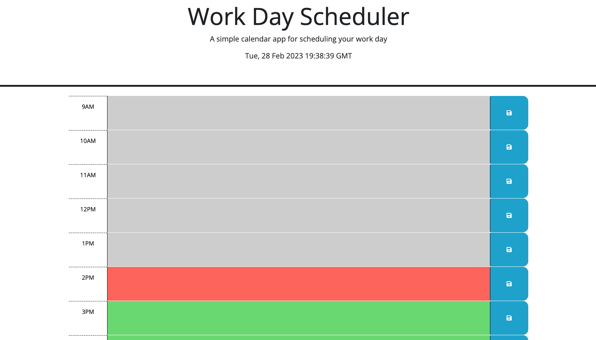

# Using Third-Party APIs: Work Day Scheduler

## Link to Deployed Webpage 
To view the "Work Day Scheduler" web application, please visit the following link: 

## The Task

Given a starter code for this week's Challenge, I used third-party funcitonality to create a calendar web application featuring JQuery, Bootstrap, and Day.js. The calendar application serves as a daily planner for users to track their work day schedules and utilitized to manage their time effectively. To build the "Work Day Scheduler", I made sure to include the following items:

* When a user opens the web application, they are presented with the current day and time at the top of the page
* As the user scrolls down the page, they are presented with time blocks based on standard business hours
* Each time block is color-coded based on a particular day to display an indication of the present hour, past hours, and future hours
* To create a new event on the calendar, the user clicks on the desired time block to add text for the event
* After creating text for a new event in the specified time block, the user clicks on the 'save' button icon and the new event is then saved to local storage

## Mock-Up

The following image displays the appearance and functionality of "Work Day Scheduler" web application:

